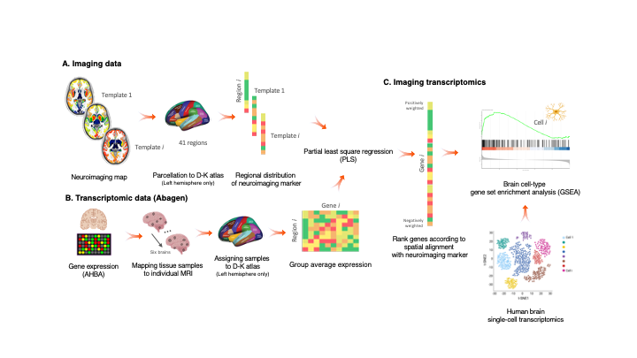

# Imaging Transcriptomics 2.0

[](https://doi.org/10.5281/zenodo.6364963)
[](https://opensource.org/licenses/MIT)
[](https://github.com/alegiac95)
[](https://www.python.org/doc/versions/)
[](https://imaging-transcriptomics.readthedocs.io/en/latest/?badge=latest)



Imaging transcriptomics links regional neuroimaging maps to Allen Human Brain Atlas gene-expression data. The `refactor-v2.0.0` branch is the upcoming `2.0` line of the toolbox: it replaces the older class-based workflow with a lighter function-based API, built-in atlas assets, simpler text and table outputs, and clearer command-line tools.

---

> **NEW in v2** `imt gene-pca` and `run_gene_pca()` add gene-list PCA with matched gene tracking, variance summaries, and atlas brain plots.
>
> **NEW in v2** `imt gedar` and `run_gedar()` add GEDAR weighted regional expression scoring from TWAS-style gene tables, including built-in gene filtering and atlas-aware output bundles.

The GEDAR workflow in this branch is inspired by the framework described in:

- Giacomel A, Powell TR, Duarte RRR, et al. *Transcriptome-informed brain cartography of polygenic risk and association with brain structure in major psychiatric disorders.* Molecular Psychiatry (2026). [https://doi.org/10.1038/s41380-026-03497-4](https://doi.org/10.1038/s41380-026-03497-4)

---

The package can be used to:

- correlate brain maps with atlas gene expression
- run PLS analyses with external spatial nulls
- perform GSEA and ORA on ranked gene outputs
- run PCA on selected gene lists
- compute GEDAR weighted regional expression scores

> **NOTE** The current stable release is still available from the main branch and on PyPI. This branch contains the refactored `2.0` workflow and is meant to be installed from the repository.

## Installation

We recommend using a dedicated environment.

Clone the repository and switch to this branch:

```bash
git clone https://github.com/alegiac95/Imaging-transcriptomics.git
cd Imaging-transcriptomics
git checkout refactor-v2.0.0
```

Create the v2 environment:

```bash
conda env create -f environment-v2.yml
conda activate imaging-transcriptomics-v2
```

Install the package:

```bash
pip install -e .
```

Optional extras:

- `pip install -e .[gsea]` for GSEA support
- `pip install -e .[maps]` for `neuromaps`/surface resampling support
- `pip install -e .[dev]` for tests and development tools

## Usage

Once installed, the toolbox can be used:

- from the command line with `imt`
- from Python with the `imaging_transcriptomics` package

The long command name `imagingtranscriptomics` still works, but `imt` is the shorter alias used throughout this branch.

### Choose a workflow

- `imt corr` or `run_corr()` for map-to-gene correlation, ranked genes, and optional GSEA or ORA
- `imt pls` or `run_pls()` for multivariate gene components and component-wise enrichment
- `imt gene-pca` or `run_gene_pca()` for PCA on a selected gene list
- `imt gedar` or `run_gedar()` for weighted regional gene-expression scoring from TWAS-style tables
- `imt atlases` and `imt genesets` to inspect atlas and geneset resources before running an analysis

### Standalone command line

Quick lookup:

```bash
imt atlases --packaged-only
imt genesets --packaged-only
imt genesets --organism Human
```

Correlation:

```bash
imt corr \
  --input /abs/path/map.nii.gz \
  --space MNI152 \
  --atlas dk \
  --hemisphere left \
  --regions default \
  --permutations 1000 \
  --null-method auto \
  --output /abs/path/out_corr
```

PLS:

```bash
imt pls \
  --input /abs/path/map.nii.gz \
  --space MNI152 \
  --atlas dk \
  --hemisphere both \
  --regions default \
  --ncomp 2 \
  --permutations 1000 \
  --null-method auto \
  --output /abs/path/out_pls
```

Gene PCA:

```bash
imt gene-pca \
  --genes RELN,GAD1,SLC1A2,SV2A \
  --atlas dk \
  --hemisphere left \
  --ncomp 2 \
  --output /abs/path/out_gene_pca
```

GEDAR:

```bash
imt gedar \
  --weights /abs/path/twas.tsv \
  --atlas dk \
  --gene-column gene_name \
  --weight-column z_mean \
  --rank-column pvalue \
  --top-percent 5 \
  --direction combined \
  --output /abs/path/out_gedar
```

This workflow is intended for weighted regional transcriptomic scoring from TWAS-style results and follows the GEDAR averaging approach used in the Molecular Psychiatry paper above.

Enrichment:

```bash
imt corr \
  --input /abs/path/map.nii.gz \
  --space MNI152 \
  --atlas dk \
  --geneset lake \
  --ora-p-threshold 0.01 \
  --gsea \
  --output /abs/path/out_enrichment
```

```bash
imt corr \
  --input /abs/path/map.nii.gz \
  --space MNI152 \
  --atlas dk \
  --geneset GO_Biological_Process_2025 \
  --geneset-organism Human \
  --ora-p-threshold 0.01 \
  --output /abs/path/out_go
```

### Python API

Correlation:

```python
import numpy as np
import imaging_transcriptomics as imt

scan = np.linspace(-1.0, 1.0, 41)
result = imt.run_corr(
    scan,
    atlas="dk",
    hemisphere="left",
    regions="default",
    n_permutations=1000,
    output_dir="out_corr",
)
```

PLS:

```python
import numpy as np
import imaging_transcriptomics as imt

scan = np.linspace(-1.0, 1.0, 83)
result = imt.run_pls(
    scan,
    atlas="dk",
    hemisphere="both",
    regions="default",
    n_components=2,
    n_permutations=1000,
    output_dir="out_pls",
)
```

Inspect atlas metadata:

```python
import imaging_transcriptomics as imt

print(imt.atlas_table(packaged_only=True))
print(imt.describe_atlas("dk"))
```

Gene-list PCA:

```python
import imaging_transcriptomics as imt

result = imt.run_gene_pca(
    ["RELN", "GAD1", "SLC1A2", "SV2A"],
    atlas="dk",
    hemisphere="left",
    n_components=2,
    output_dir="out_gene_pca",
)
```

GEDAR:

```python
import imaging_transcriptomics as imt

result = imt.run_gedar(
    "twas.tsv",
    atlas="dk",
    gene_column="gene_name",
    weight_column="z_mean",
    rank_column="pvalue",
    top_percent=5,
    direction="combined",
    output_dir="out_gedar",
)
```

This is the most direct way to reproduce or extend a GEDAR-style atlas projection from a weighted gene table inside Python.

## Included atlases

The branch ships with packaged atlas assets and expression matrices for these
base presets:

- `dk`
- `schaefer-100`
- `schaefer-200`
- `schaefer-400`
- `destrieux`
- `glasser-360`

All atlas names now use the same region-scope interface:

- `regions="default"` or `regions="cort"` keeps the cortical atlas
- `regions="all"` or `regions="cort+sub"` adds the packaged `aseg`
  subcortical extension

`dk` uses the same model, so the atlas name stays simple there as well.

The expression matrices are derived with `abagen`. For `hemisphere="both"`, the right side is obtained through the `abagen` mirror option (`lr_mirror="leftright"`).

## Inputs

Version `2.0` accepts:

- regional vectors as NumPy arrays, text files, or tabular files
- volumetric NIfTI maps in `MNI152`
- surface files and non-MNI inputs through `neuromaps` when the `maps` extra is installed

If the input map is already in `MNI152`, the package can extract region values directly from the packaged atlas image. For surface or non-MNI standard-space inputs, `neuromaps` can resample the input before analysis.

> **VALID INPUTS** Good inputs include an atlas-length regional vector, a derived neuroimaging map already in `MNI152`, or a supported surface file. A raw subject T1w anatomical image is not a valid direct input for `corr` or `pls`; it should first be transformed into a meaningful derived map in standard space.

Examples:

- valid: `41` left-hemisphere DK values in a text file
- valid: a PET or MRI-derived NIfTI map in `MNI152`
- valid: a supported surface map when the `maps` extra is installed
- not valid: a native-space subject T1w scan used directly as an analysis map

## Outputs

Each workflow writes a simple result bundle with:

- `README.txt`
- `metadata.json`
- workflow-specific TSV tables
- matched and missing gene lists when relevant
- plot PNGs in `plots/`

Typical outputs include:

- `corr_genes.tsv`, `gsea_corr_results.tsv`, `ora_corr_up.tsv`, `ora_corr_down.tsv`
- `pls_summary.tsv`, `pls_component_<n>.tsv`
- `gene_pca_scores.tsv`, `gene_pca_loadings.tsv`, `gene_pca_variance.tsv`
- `gedar_scores.tsv`, `gedar_genes.tsv`, `gedar_excluded.tsv`

Core output files:

| File | Purpose |
| --- | --- |
| `README.txt` | Run-specific summary of settings, main results, and generated files |
| `metadata.json` | Machine-readable record of atlas, options, counts, and output paths |
| `corr_genes.tsv` | Ranked correlation gene table with `score`, `p`, `fdr`, and `maxT` |
| `pls_summary.tsv` | Component-level PLS summary with explained variance and permutation `p` |
| `pls_component_<n>.tsv` | Gene weights and statistics for each PLS component |
| `gene_pca_scores.tsv` | Regional PCA component scores for the selected gene list |
| `gene_pca_loadings.tsv` | Gene loadings for each PCA component |
| `gedar_scores.tsv` | Regional GEDAR scores for the matched weighted gene set |
| `gedar_genes.tsv` | Genes retained in GEDAR with the effective weights used |

PDF reporting was removed in this refactor. The default outputs are plain text, tables, JSON metadata, and PNG figures.

## Documentation

The in-repo documentation lives under [`docs/`](docs). The CLI help is also intentionally descriptive and is often the quickest way to inspect a workflow:

```bash
imt --help
imt corr --help
imt pls --help
imt gene-pca --help
imt gedar --help
```

## Troubleshooting

Common issues on this branch:

- raw subject T1w scans are not valid direct inputs; the map should be a meaningful derived image in `MNI152`, or a regional vector
- if cortical null generation falls back unexpectedly, set a writable `NEUROMAPS_DATA` cache and make sure the `maps` extra is installed
- if a cloud-synced file under Dropbox or iCloud raises a macOS permission error, copy it to a regular local folder before running the analysis
- for gene-level FDR with correlation, low permutation counts can make adjusted p-values collapse to `1`; use substantially more permutations if gene-level multiple-testing correction matters

For problems with the software, please [open an issue on GitHub](https://github.com/alegiac95/Imaging-transcriptomics/issues).

## Development

Install the development extra and run the test suite:

```bash
pip install -e .[dev]
pytest -q
```

Focused suites that are especially useful on this branch:

```bash
pytest -q imaging_transcriptomics/tests/v2_test.py
pytest -q imaging_transcriptomics/tests/pvalues_test.py
pytest -q imaging_transcriptomics/tests/golden_test.py
pytest -q imaging_transcriptomics/tests/cli_test.py imaging_transcriptomics/tests/plotting_test.py
```

## Citing

If you publish work using this toolbox, please cite:

- Martins D, Giacomel A, Williams SCR, Turkheimer F, Dipasquale O, Veronese M. *Imaging transcriptomics: Convergent cellular, transcriptomic, and molecular neuroimaging signatures in the healthy adult human brain.* Cell Reports. [https://doi.org/10.1016/j.celrep.2021.110173](https://doi.org/10.1016/j.celrep.2021.110173)
- Giacomel A, Martins D. *Imaging-transcriptomics: Second release update (v1.0.2).* Zenodo. [https://doi.org/10.5281/zenodo.5726839](https://doi.org/10.5281/zenodo.5726839)
- Giacomel A, Martins D, Frigo M, Turkheimer F, Williams SCR, Dipasquale O, Veronese M. *Integrating neuroimaging and gene expression data using the imaging transcriptomics toolbox.* STAR Protocols. [https://doi.org/10.1016/j.xpro.2022.101315](https://doi.org/10.1016/j.xpro.2022.101315)
- Giacomel A, Powell TR, Duarte RRR, et al. *Transcriptome-informed brain cartography of polygenic risk and association with brain structure in major psychiatric disorders.* Molecular Psychiatry (2026). [https://doi.org/10.1038/s41380-026-03497-4](https://doi.org/10.1038/s41380-026-03497-4)
