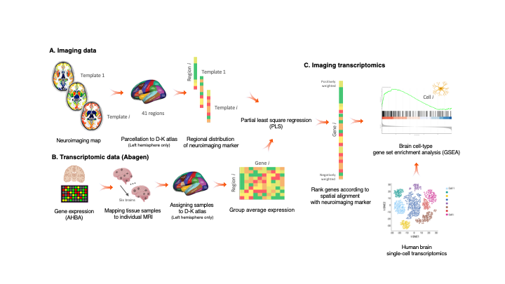
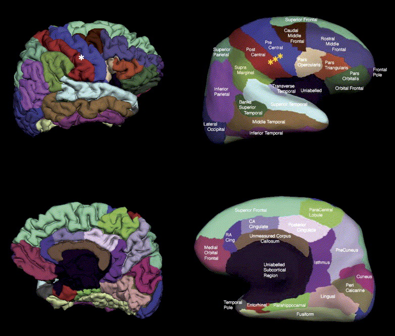

.. _imgtrans:

================================
What is imaging transcriptomics?
================================

Imaging transcriptomics is a methodology that allows to identify patterns of correlation between gene expression and some property of brain structure or function as measured by neuroimaging (e.g., MRI, fMRI, PET).

An overview of the methodology can be seen in the figure below.

In brief, average values of the scan are extracted from 41 brain regions as defined by the Desikan-Killiany (DK) atlas. Regional values are then used to perform partial least squares (PLS) regression with gene expression data from the Allen Human Brain Atlas (AHBA) mapped to the DK atlas, in the left hemisphere only.

As a result of the PLS regression we obtain the ranked genes list according to the spatial alignment with the neuroimaging marker of interest.

.. seealso:: For a more comprehensive dive into the methodology have a look at our paper: `Imaging transcriptomics: Convergent cellular, transcriptomic, and molecular neuroimaging signatures in the healthy adult human brain. <https://doi.org/10.1101/2021.06.18.448872>`_ *Daniel Martins, Alessio Giacomel, Steven CR Williams, Federico Turkheimer, Ottavia Dipasquale, Mattia Veronese, PET templates working group*. bioRxiv 2021.06.18.448872; doi: `https://doi.org/10.1101/2021.06.18.448872 <https://doi.org/10.1101/2021.06.18.448872>`_

Allen Human Brain Atlas
-----------------------
The Allen Human Brain Atlas (AHBA) freely available multimodal atlas of gene expression and anatomy comprising a comprehensive ‘all genes–all structures’ array-based dataset of gene expression and complementary *in situ hybridization* (ISH) gene expression studies targeting selected genes in specific brain regions. Available via the Allen Brain Atlas data portal (`www.brain-map.org <www.brain-map.org>`_), the Atlas integrates structure, function, and gene expression data to accelerate basic and clinical research of the human brain in normal and disease states [Shein2012]_.

The ``imaging-transcriptomics`` script uses a modified version of the AHBA gene data parcellated onto 83 regions from the DK atlas obtained using the `abagen toolbox <https://github.com/netneurolab/abagen>`_.
In brief, probes that cannot be reliably matched to genes were discarded and filtered based on their intensity compared to the background noise level. The remainig probes were pooled retaining only the one with the highest differential stability to represent each gene, resulting in 15,633 probes each representing an unique gene. The genes were then assigned to brain regions based on their corrected MNI coordinates.

More details on the processing of the transcriptomic data are available in the methods section of the paper [Martins2021]_.

Desikan-Killiany Atlas
----------------------
The DK atlas is a parcellation atlas of the human brain, which includes both cortical and subcortical regions.

This atlas is derived from a dataset of 40 MRI scans where 34 cortical ROIs were manually delineated for each of the individual hemispheres. More details on the ROIs of the atlas or methods to derive it refer to the original paper [Desikan2006]_

    Representation of the pial and inflated view of the cortical regions from the Desikan-Killiany atlas. Image from the `orignal paper <https://doi.org/10.1016/j.neuroimage.2006.01.021>`_ [Desikan2006]_

Partial least squares
---------------------
The goal of any regression is to model the relationship between a target variable and multiple explanatory variables. The standard approach is to use Ordinary Least Squares (OLS), but in order to use OLS the assumptions of linear regression have to be met.
The assumptions of linear regression are:

* Independence of observations
* No hidden or missing variables
* Linear relationship
* Normality of the residuals
* No or little multicollinearity
* Homoscedasticity
* All independent variables are uncorrelated with the error term
* Observations of the error term are uncorrelated with each other

In some cases it can be that we have a lot of independent variables, many of which are correlated with other independent variables, violating thus the assumption of no multicollinearity.
In this case instead of using OLS a more appropriate method is to use Partial Least Squares (PLS) Regression. This method allows to reduce the dimensionality of correlated variables and model the underlying information shared.

.. rubric:: References

.. [Martins2021] **Imaging transcriptomics: Convergent cellular, transcriptomic, and molecular neuroimaging signatures in the healthy adult human brain.** *Daniel Martins, Alessio Giacomel, Steven CR Williams, Federico Turkheimer, Ottavia Dipasquale, Mattia Veronese, PET templates working group*. bioRxiv 2021.06.18.448872; doi: `https://doi.org/10.1101/2021.06.18.448872 <https://doi.org/10.1101/2021.06.18.448872>`_

.. [Shein2012] **The Allen Human Brain Atlas: Comprehensive gene expression mapping of the human brain.** *Elaine H. Shein, Caroline C. Overly, Allan R. Jones*, Trends in Neuroscience vol. 35, issue 12, December 2012; doi: `https://doi.org/10.1016/j.tins.2012.09.005 <https://doi.org/10.1016/j.tins.2012.09.005>`_

.. [Desikan2006] **An automated labeling system for subdividing the human cerebral cortex on MRI scans into gyral based regions of interest.** *Rahul S.Desikan, Florent Ségonne, Bruce Fischl, Brian T. Quinn, Bradford C. Dickerson, Deborah Blacker, Randy L. Buckner, Anders M. Dale, R. Paul Maguire, Bradley T. Hyman, Marilyn S. Albert, Ronald J. Killiany*, NeuroImage, Volume 31, Issue 3, July 2006; doi: `https://doi.org/10.1016/j.neuroimage.2006.01.021 <https://doi.org/10.1016/j.neuroimage.2006.01.021>`_

.. [Tobias1996] **An Introduction to Partial Least Squares Regression.** *R. Tobias*, `https://stats.idre.ucla.edu/wp-content/uploads/2016/02/pls.pdf <https://stats.idre.ucla.edu/wp-content/uploads/2016/02/pls.pdf>`_

.. [Naers1985] **Comparison of prediction methods for multicollinear data**, *T. Naes and H. Martens*, Communications in Statistics, Simulation and Computation, 14(3), 545-576.

.. [deJong1993] **SIMPLS: An alternative approach to partial least squares regression.** *Sijmen de Jong*, Chemometrics and Intelligent Laboratory Systems, March 1993, doi: `https://doi.org/10.1016/0169-7439(93)85002-X <https://doi.org/10.1016/0169-7439(93)85002-X>`_

.. [Vertes2016] **Gene transcription profiles associated with inter-modular hubs and connection distance in human functional magnetic resonance imaging networks.** *Petra E. Vértes, Timothy Rittman, Kirstie J. Whitaker, Rafael Romero-Garcia, František Váša, Manfred G. Kitzbichler, Konrad Wagstyl, Peter Fonagy, Raymond J. Dolan, Peter B. Jones, Ian M. Goodyer, the NSPN Consortium and Edward T. Bullmore*, Philosophical Transactions of the Royal Society B, October 2016, doi: `https://doi.org/10.1098/rstb.2015.0362 <https://doi.org/10.1098/rstb.2015.0362>`_
