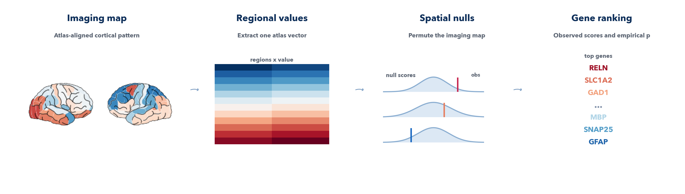

====================
Correlation workflow
====================

This page is the user guide for ``imt corr`` and ``run_corr()``.

   Start from an atlas-aligned brain map, collapse it into regional values, generate spatial nulls, and rank genes against the observed regional profile.

What the workflow answers
-------------------------

The correlation workflow asks:

*Which genes have regional expression patterns that follow the imaging map
most closely, either positively or negatively, across the selected atlas
regions?*

It is the simplest entry point in the toolbox and is often the best first pass
for a new map.

Inputs
------

You need:

- one regional vector or one valid imaging map
- an atlas
- a hemisphere and region scope
- a permutation count

Accepted inputs include:

- an atlas-length vector
- a text, CSV, or TSV table that can be interpreted as a regional vector
- an ``MNI152`` NIfTI map
- supported surface files through the standard ``neuromaps`` runtime support

The workflow does not accept a raw native-space T1w anatomical image as a
meaningful direct imaging phenotype.

Core computation
----------------

For every gene in the atlas expression matrix, the workflow:

1. rank-transforms the imaging vector across regions
2. rank-transforms the gene expression values across regions
3. standardizes both ranked vectors
4. computes a rank-based correlation

The observed statistic for gene ``g`` is:

.. math::

   r_g = \frac{\tilde{x}^{\mathsf T} \tilde{g}}{n - 1}

where :math:`n` is the number of atlas rows in the selected subset.

This is equivalent to Spearman rank correlation when there are no ties. When
ties are present, the implementation resolves them by stable ordering instead
of average ranks, which keeps the computation fast and deterministic for large
gene matrices.

Null model and p-values
-----------------------

The imaging vector is permuted ``B`` times using the selected null model. Each
permuted imaging vector is then correlated against the same ranked atlas
expression matrix.

The gene-level nominal p-value is sign-aware:

.. math::

   p_g =
   \begin{cases}
   \frac{1 + \sum_{b=1}^{B} I(r_g^{(b)} \ge r_g)}{B + 1}, & r_g \ge 0 \\
   \frac{1 + \sum_{b=1}^{B} I(r_g^{(b)} \le r_g)}{B + 1}, & r_g < 0
   \end{cases}

So a positive gene is tested against the upper tail of its null distribution,
and a negative gene is tested against the lower tail.

The exported columns mean:

``score``
   Observed correlation for that gene.

``p``
   Gene-specific empirical p-value from the permutation null.

``fdr``
   Benjamini-Hochberg correction across all genes in the run.

``maxT``
   Family-wise correction based on the largest absolute null correlation in
   each permutation.

``maxT`` is intentionally harsher than ``fdr``. It is normal for a gene to
have a small ``p`` but a much larger ``maxT``.

CLI examples
------------

Basic correlation run:

.. code-block:: bash

   imt corr \
     --input /abs/path/map.nii.gz \
     --space MNI152 \
     --atlas dk \
     --hemisphere left \
     --regions all \
     --permutations 1000 \
     --null-method auto \
     --output /abs/path/out_corr

Run correlation with ORA only:

.. code-block:: bash

   imt corr \
     --input /abs/path/map.nii.gz \
     --space MNI152 \
     --atlas dk \
     --geneset lake \
     --ora-p-threshold 0.01 \
     --output /abs/path/out_corr

Run correlation with both ORA and GSEA:

.. code-block:: bash

   imt corr \
     --input /abs/path/map.nii.gz \
     --space MNI152 \
     --atlas dk \
     --geneset GO_Biological_Process_2025 \
     --geneset-organism Human \
     --ora-p-threshold 0.01 \
     --gsea \
     --output /abs/path/out_corr

Python example
--------------

.. code-block:: python

   import numpy as np
   import imaging_transcriptomics as imt

   scan = np.linspace(-1.0, 1.0, 41)
   result = imt.run_corr(
       scan,
       atlas="dk",
       hemisphere="left",
       regions="all",
       n_permutations=1000,
       output_dir="out_corr",
   )

Reading the gene table
----------------------

The main output is ``corr_genes.tsv``.

High positive ``score``
   The gene is expressed more strongly in regions where the imaging map is
   larger.

High negative ``score``
   The gene is expressed more strongly in regions where the imaging map is
   smaller.

Small ``p``
   The gene is unusual relative to its own permutation null.

Small ``fdr``
   The gene remains notable after correcting across the full gene table.

Small ``maxT``
   The gene is stronger than the strongest absolute null gene expected in most
   permutations.

If you only care about pathway-level interpretation, it is common to focus on
the ranked gene table plus GSEA or ORA rather than on gene-level adjusted
significance alone.

GSEA and ORA
------------

The correlation workflow supports both enrichment modes:

- GSEA uses the full ranked gene list
- ORA thresholds genes by raw gene ``p`` and splits them into positive and
  negative sets

Good practical defaults:

- GSEA when you want a threshold-free pathway analysis
- ORA when you want hit lists, odds ratios, and overlap genes
- both when you want complementary views of the same result

See the enrichment workflow page and the gene-set methodology page for the
exact formulas used for ``NES``, ORA odds ratios, and enrichment ``fdr``.

Runtime and scaling notes
-------------------------

Correlation itself is fast because the gene-level correlations are vectorized.
The main runtime costs are:

- generating the imaging nulls
- storing or processing very large permutation counts
- GSEA on large gene-set collections

Two common patterns:

- many permutations improve gene-level p-value resolution
- large GSEA libraries can dominate runtime even when the correlation step is
  fast

Practical advice:

- use ``--no-gsea`` when you only want genes or ORA
- use a modest library such as ``lake`` for quick enrichment smoke tests
- increase permutations substantially if gene-level ``fdr`` matters

Common pitfalls
---------------

- using a native-space subject T1w scan directly as the input map
- forgetting ``--space MNI152`` when the input is already in standard space
- interpreting a flat gene-level ``fdr`` column as a bug when the real problem
  is low permutation resolution
- assuming ORA thresholds on gene ``fdr``; it currently thresholds on raw gene
  ``p``
