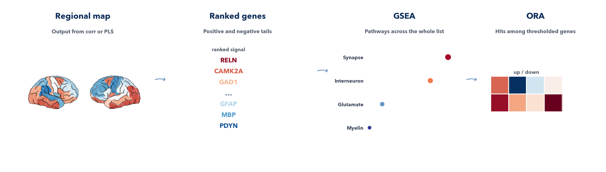
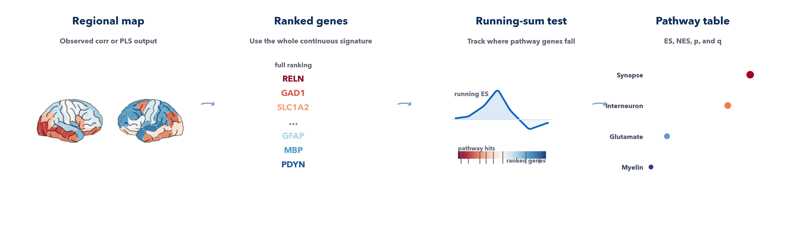
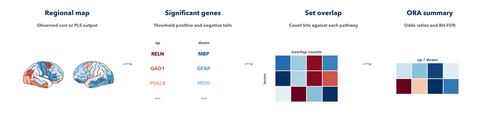
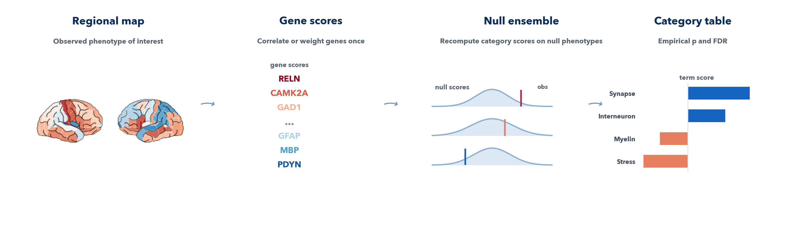

=====================
Enrichment workflows
=====================

Enrichment moves the interpretation from single genes to broader biological
themes such as pathways, cell types, or curated disease-relevant signatures.
In imaging transcriptomics, this step is often applied after ``corr`` or
after each retained PLS component, once the workflow has produced a gene-wise
score for the phenotype of interest.

Because gene-set interpretation is especially sensitive to null choice and to
how the gene universe is defined, this page should be read together with the
more formal :doc:`/chapters/methods/gene_sets` page and, for the broader
imaging-transcriptomics context, with the practical and review papers by
`Arnatkeviciute et al. (2019)
<https://doi.org/10.1016/j.neuroimage.2019.01.011>`_ and
`Fulcher et al. (2021) <https://doi.org/10.1038/s41467-021-22862-1>`_.

   A single ranked gene signature can be summarized in several different ways:
   GSEA uses the full ranking, ORA focuses on thresholded gene tails, and
   ensemble-GCEA compares category scores against null phenotypes.

What the workflow answers
-------------------------

The enrichment workflows ask:

*Given a gene signature derived from a brain phenotype, which pathways,
cell-type signatures, or gene categories show the most coherent signal, and
how does that answer depend on the enrichment method used?*

General introduction
--------------------

All enrichment methods start from the same broad idea:

- derive a gene-level statistic from the imaging-transcriptomic workflow
- map those genes to pathways or other gene categories
- summarize the signal at the category level
- assess whether the observed category signal is stronger than expected

The main difference between enrichment families is *what they summarize* and
*what they treat as the null model*.

In practice, the three main families are:

- ``GSEA``: ranking-based enrichment across the full ordered gene list
- ``ORA``: over-representation among thresholded positive or negative hits
- ``ensemble-GCEA``: category scores tested against null phenotypes

Method comparison
-----------------

.. list-table:: Main enrichment families in imaging transcriptomics
   :header-rows: 1
   :widths: 16 22 20 20 22

   * - Method
     - Starts from
     - Core statistic
     - Typical null
     - Best use case
   * - ``GSEA``
     - A full ranked gene list
     - Running-sum enrichment score across the ranking
     - Rank-based or phenotype-derived enrichment nulls
     - When the continuous ordering of all genes is important
   * - ``ORA``
     - A selected subset of significant genes
     - Overlap count, enrichment ratio, or odds ratio
     - Hypergeometric overlap against a gene background
     - When you want a simple hit-list interpretation
   * - ``Ensemble-GCEA``
     - A gene-wise score derived from the observed phenotype
     - Category score, often the mean gene score in the set
     - Null phenotypes or spatially matched phenotype ensembles
     - When you want imaging-transcriptomics enrichment tied directly to phenotype nulls

One practical way to think about them is:

- ``GSEA`` asks whether category members cluster near the top or bottom of a ranking
- ``ORA`` asks whether category members are over-represented among selected hits
- ``ensemble-GCEA`` asks whether a category score is unusually strong under null phenotypes

Current toolbox status
----------------------

The toolbox currently supports:

- ``ensemble-GCEA`` after ``corr`` and after each retained PLS component
- ``GSEA`` after ``corr`` and after each retained PLS component
- ``ORA`` after ``corr`` and after each retained PLS component

The default enrichment backend is now ``ensemble``, while ``GSEA`` and ``ORA``
remain available when you want a more traditional rank-based or thresholded
interpretation. That default follows the broader argument, emphasized by
`Fulcher et al. (2021) <https://doi.org/10.1038/s41467-021-22862-1>`_, that
phenotype-aware nulls are often the most defensible starting point for
brain-map enrichment.

GSEA
----

   GSEA keeps the whole ranked signature and asks whether genes from a category
   tend to appear preferentially near the top or bottom of that ranking.

What GSEA tests
~~~~~~~~~~~~~~~

GSEA starts from a continuous ranked gene list. Instead of discarding genes
below an arbitrary threshold, it scans through the whole ranking and tracks
whether the members of a pathway accumulate near one end of the list more than
expected by chance.

That makes it useful when:

- the gene scores form a graded spectrum rather than a clean hit list
- positive and negative extremes are both biologically meaningful
- you want to preserve ordering information across the entire signature

Simple example
~~~~~~~~~~~~~~

Imagine the top of the ranked list contains:

- ``RELN``
- ``GAD1``
- ``PVALB``
- ``SLC1A2``

and a pathway such as ``interneuron markers`` contains several of those genes.
GSEA will score that pathway highly because its members concentrate near the
upper tail of the ranking, even if many other pathway genes are only moderately
positive and never cross a hard significance cutoff.

How to read the result
~~~~~~~~~~~~~~~~~~~~~~

The most important GSEA outputs are:

``Term``
   Pathway or gene-category name.

``es``
   Observed enrichment score from the running-sum statistic.

``nes``
   Normalized enrichment score.

``p_val``
   Nominal p-value for the enrichment score.

``fdr``
   GSEA-style multiple-testing summary across terms.

.. important::

   GSEA is a ranking-based method. It is not the same as testing category
   scores directly against null phenotypes. In other words, it is excellent
   for describing how a pathway sits inside a ranked signature, but it is not
   the same inferential object as ensemble-GCEA.

ORA
---

   ORA turns the ranked signature into positive and negative hit lists, then
   asks whether each pathway is over-represented in those selected genes.

What ORA tests
~~~~~~~~~~~~~~

ORA is a thresholded enrichment method. You first choose a subset of genes,
for example those with raw gene-level ``p <= 0.01`` or the strongest positive
and negative tails, and then test whether a pathway contains more of those hits
than expected given the background gene universe.

That makes it useful when:

- you want a simple, easy-to-explain enrichment table
- your interpretation focuses on the strongest positive and negative hits
- you want separate ``up`` and ``down`` pathway summaries

Simple example
~~~~~~~~~~~~~~

Suppose only the top positive genes are retained:

- ``RELN``
- ``GAD1``
- ``PVALB``

If a pathway such as ``interneuron markers`` contains two of those three hits,
ORA may report that the pathway is over-represented in the positive tail.
However, genes ranked just below the threshold no longer contribute to the test.

How to read the result
~~~~~~~~~~~~~~~~~~~~~~

ORA writes separate ``up`` and ``down`` tables. The most useful columns are:

``overlap_size``
   Number of selected genes that overlap the term.

``selected_size``
   Number of genes in the tested tail.

``enrichment_ratio``
   Observed overlap divided by expected overlap.

``odds_ratio``
   Strength of enrichment in the contingency table.

``p_value``
   Hypergeometric enrichment p-value.

``fdr``
   Benjamini-Hochberg correction across ORA terms within that direction.

.. important::

   ORA depends strongly on the threshold and on the chosen background
   universe. In imaging transcriptomics, the most defensible background is
   usually the set of genes that were actually tested in the atlas expression
   matrix, not the full human transcriptome.

Ensemble-GCEA
-------------

   Ensemble-GCEA shifts the question from ranking position to category
   score, and evaluates that score against a phenotype-null ensemble.

What ensemble-GCEA tests
~~~~~~~~~~~~~~~~~~~~~~~~

Ensemble-GCEA starts from the observed phenotype and computes a gene-wise
score, for example:

- gene-map correlation in ``corr``
- component weights or related gene scores in ``PLS``

Then, for each pathway, it computes a category-level summary statistic, often
the mean gene score across all genes annotated to that pathway. The same
category score is recomputed across many null phenotypes, and significance is
assessed relative to that null distribution.

That makes it useful when:

- phenotype nulls are the main inferential concern
- spatial autocorrelation must be propagated all the way to enrichment
- you want category-level inference rather than rank-position inference

Simple example
~~~~~~~~~~~~~~

Imagine a pathway contains four genes with scores:

- ``0.90``
- ``0.78``
- ``0.10``
- ``0.05``

The pathway mean is still clearly positive, even if only two genes sit near the
top of the ranking. Ensemble-GCEA compares that observed pathway score to
the same pathway score computed from null phenotypes. If the null category
means are usually much smaller, the pathway is significant.

How to read the result
~~~~~~~~~~~~~~~~~~~~~~

A typical ensemble-GCEA output table would contain:

``Term``
   Pathway or gene-category name.

``category_score``
   Observed pathway score, often the mean gene score.

``null_mean`` / ``null_sd``
   Summary of the category score under the null phenotype ensemble.

``z_score``
   Standardized distance between observed and null category scores.

``p_val``
   Empirical sign-aware p-value from the null phenotype ensemble.

``fdr``
   Multiple-testing correction across terms.

.. important::

   This is not simply a faster or slower version of GSEA. It is a different
   methodological family, with a different test statistic and a different
   null. For imaging transcriptomics, it is often the most natural way to
   align enrichment with spatially constrained null phenotypes.

Choosing between methods
------------------------

.. tip::

   If you are unsure which family to use, a practical rule of thumb is:

   - choose ``GSEA`` when the full ranking is the main object of interest
   - choose ``ORA`` when you want a simple hit-list summary and are comfortable with a threshold
   - choose ``ensemble-GCEA`` when the scientific question is explicitly about category scores under phenotype nulls

.. tip::

   In many studies, it is reasonable to use more than one family:

   - ``GSEA`` for a broad ranked overview
   - ``ORA`` for a compact hit-list interpretation
   - ``ensemble`` for ensemble-GCEA and the strongest phenotype-null inference

Current toolbox usage
---------------------

The main shared controls are:

- packaged genesets such as ``lake`` and ``pooled``
- local ``.gmt`` files
- remote Enrichr libraries resolved through ``gseapy``

Choose the backend with ``--enrichment`` on the CLI or ``enrichment_method=``
in the Python API:

- ``ensemble`` for ensemble-GCEA style category scores against phenotype nulls
- ``gsea`` for preranked GSEA
- ``ora`` for thresholded over-representation analysis

When ``--enrichment ora`` is selected, ``--ora-p-threshold`` controls the raw
gene-level threshold used to build the ``up`` and ``down`` hit lists.

Useful commands:

.. code-block:: bash

   imt genesets --packaged-only
   imt genesets --organism Human

Example ``corr`` runs:

.. code-block:: bash

   imt corr \
     --input /abs/path/map.nii.gz \
     --space MNI152 \
     --atlas dk \
     --enrichment ensemble \
     --geneset GO_Biological_Process_2025 \
     --geneset-organism Human \
     --output /abs/path/out_dir

.. code-block:: bash

   imt corr \
     --input /abs/path/map.nii.gz \
     --space MNI152 \
     --atlas dk \
     --geneset GO_Biological_Process_2025 \
     --geneset-organism Human \
     --enrichment gsea \
     --output /abs/path/out_dir

.. code-block:: bash

   imt corr \
     --input /abs/path/map.nii.gz \
     --space MNI152 \
     --atlas dk \
     --geneset GO_Biological_Process_2025 \
     --geneset-organism Human \
     --enrichment ora \
     --ora-p-threshold 0.01 \
     --output /abs/path/out_dir
