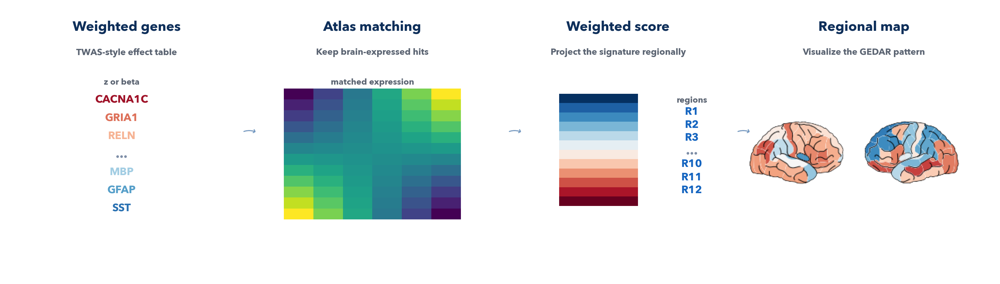

==============
GEDAR workflow
==============

This page is the user guide for ``imt gedar`` and ``run_gedar()``.

   Start from a weighted gene signature, align it to atlas expression, project it regionally, and visualize the resulting GEDAR map.

What the workflow answers
-------------------------

The GEDAR workflow asks:

*Where in the brain is the transcriptomic signature of genetically associated disease risk most strongly expressed, 
given a TWAS-derived weighted gene set?*

It is the simplest entry point in the toolbox and is often the best first pass
for a new map.

What the workflow does
----------------------

GEDAR takes a weighted gene table, matches it to the selected atlas expression
matrix, and computes a regional weighted-expression score.

At a high level, the workflow:

1. loads a gene-weight table
2. cleans invalid rows and resolves duplicate symbols
3. applies the packaged brain-gene filter
4. matches the remaining genes to the atlas expression matrix
5. optionally selects a top subset of genes by rank
6. computes a weighted regional average

This makes GEDAR useful for TWAS-style or other ranked gene-weight analyses
where the end goal is a regional transcriptomic score rather than a gene-level
association test.

Interpretation
--------------

The Gene-Expression derived Disorder Associated Risk (GEDAR) score is a regional weighted-expression summary. It is not a p-value
and it is not itself a statistical association test.

Interpret it as:

- a transcriptomic regional pattern induced by the retained weighted genes
- a map that can be inspected directly or compared with imaging maps in a
  separate analysis

The z-scored output is usually the most convenient version for plotting and
map-to-map comparison.

Inputs
------

GEDAR expects a CSV or TSV table with at least:

- one gene-symbol column
- one weight column

Optional columns include:

- one ranking column used for top-percent, top-n, or threshold selection

Typical examples:

- TWAS or MetaXcan tables
- weighted gene signatures
- ranked disease-associated gene tables

Cleaning and filtering
----------------------

Before the score is computed, the toolbox automatically removes:

- blank gene symbols
- non-finite weights
- non-finite rank values when a rank column is in use
- duplicated gene symbols
- genes outside the packaged brain-gene filter

Excluded rows are written to ``gedar_excluded.tsv`` so the cleaning step is
fully auditable.

Score definition
----------------

Let:

- :math:`x_{r,g}` be atlas expression for region :math:`r` and gene :math:`g`
- :math:`w_g` be the retained gene weight

In ``combined`` mode the GEDAR score is the weighted average:

.. math::

   GEDAR_r = \frac{\sum_g x_{r,g} w_g}{\sum_g w_g}

In directional modes:

- ``up`` keeps only positive genes and uses absolute retained weights
- ``down`` keeps only negative genes and uses absolute retained weights
- ``split`` computes both directional scores in one run

The output table reports:

- the raw regional score
- a z-scored regional version across the selected regions

If expression normalization is enabled, atlas expression is standardized across
regions before the weighted average is computed.

Gene selection controls
-----------------------

GEDAR can score all matched genes or a selected subset.

Available selection rules:

- ``--top-percent``
- ``--top-n``
- ``--p-threshold``

These use the requested ``--rank-column`` and ``--rank-mode``.

Examples:

- ascending rank mode for p-values or FDR-like columns
- descending rank mode for effect-size or score columns where larger is better

CLI examples
------------

Basic GEDAR run:

.. code-block:: bash

   imt gedar \
     --weights /absolute/path/to/twas.tsv \
     --atlas dk \
     --gene-column gene_name \
     --weight-column z_mean \
     --rank-column pvalue \
     --top-percent 5 \
     --direction combined \
     --output /absolute/path/to/out_dir

Directional split:

.. code-block:: bash

   imt gedar \
     --weights /absolute/path/to/twas.tsv \
     --atlas dk \
     --gene-column gene_name \
     --weight-column z_mean \
     --rank-column pvalue \
     --top-percent 5 \
     --direction split \
     --output /absolute/path/to/out_dir

Python example
--------------

.. code-block:: python

   import imaging_transcriptomics as imt

   result = imt.run_gedar(
       "/absolute/path/to/twas.tsv",
       atlas="dk",
       gene_column="gene_name",
       weight_column="z_mean",
       rank_column="pvalue",
       top_percent=5,
       direction="combined",
       output_dir="out_gedar",
   )

Reading the outputs
-------------------

``gedar_scores.tsv``
   Regional GEDAR scores. In split mode this includes separate up and down
   score columns.

``gedar_genes.tsv``
   The matched gene table actually used for scoring, including the effective
   retained weights and selection flags.

``gedar_excluded.tsv``
   Rows removed during cleaning and filtering.

``matched_genes.txt`` and ``missing_genes.txt``
   Simple audit files for gene matching.

.. caution::

   Common pitfalls:

   - forgetting to set the correct gene column or weight column
   - using a rank column without thinking about whether lower or higher values
     should be considered better
   - being surprised by missing genes when they were actually removed by the
     packaged brain-gene filter and recorded in ``gedar_excluded.tsv``
