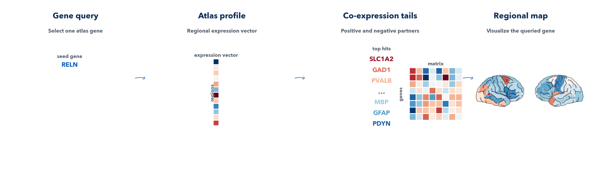

====================
Single-gene workflow
====================

This page is the user guide for ``imt gene`` and ``run_gene()``.

   Start from one gene symbol, extract its atlas-aligned expression profile, summarize its strongest co-expression partners, and visualize the regional pattern on the brain.

What the workflow answers
-------------------------

The single-gene workflow asks:

*Where is this gene most strongly expressed across the selected atlas, and which other genes show the most similar or opposite regional expression pattern?*

Use this workflow when you want a compact atlas-level summary for one gene
without running a full imaging-to-transcriptomics analysis.

What the workflow does
----------------------

The workflow is descriptive rather than inferential against an imaging map.
It:

1. resolves one user-supplied gene symbol in the selected atlas
2. extracts the regional expression vector for that gene
3. correlates that pattern against every other atlas gene
4. reports the strongest positive and negative co-expression partners
5. writes summary tables and atlas plots for quick inspection

This makes it useful for exploratory gene-centric questions such as:

- where is this marker gene most strongly expressed?
- which genes appear to track the same regional pattern?
- which genes show the most opposite regional profile?

Inputs
------

You need:

- one gene symbol
- an atlas
- a hemisphere and region scope

There is no imaging map input for this workflow. The atlas expression matrix
itself is the data source.

Core computation
----------------

Let :math:`x_g` be the regional expression vector of the queried gene and
:math:`x_j` the vector for another atlas gene :math:`j`.

For each atlas gene, the workflow computes:

.. math::

   \rho_j = \mathrm{Spearman}(x_g, x_j)

The exported co-expression table then applies:

- a two-sided asymptotic p-value for the Spearman statistic
- Benjamini-Hochberg correction across all tested genes

The compact result bundle keeps only the strongest significant positive and
negative tails, using the configured ``top_n`` limit per direction.

Main outputs
------------

``gene_query_summary.tsv``
   One-row summary of the queried gene, atlas, expression range, and hit
   counts.

``gene_expression.tsv``
   Atlas-aligned regional expression vector for the requested gene.

``top_expression_regions.tsv``
   Highest-expression regions for the queried gene.

``top_coexpressed_genes.tsv``
   Top significant positively co-expressed genes.

``top_negatively_correlated_genes.tsv``
   Top significant negatively correlated genes.

The workflow also writes:

- an atlas brain map
- a cortical surface map
- an optional BrainSpace cortical comparison
- a compact co-expression heatmap
- a ranked positive/negative tail plot

CLI examples
------------

Basic gene query:

.. code-block:: bash

   imt gene \
     --gene RELN \
     --atlas dk \
     --hemisphere left \
     --top-n 25 \
     --output /absolute/path/to/out_dir

Use both hemispheres and keep raw expression values:

.. code-block:: bash

   imt gene \
     --gene MBP \
     --atlas schaefer-200 \
     --hemisphere both \
     --raw-expression \
     --fdr-threshold 0.01 \
     --output /absolute/path/to/out_dir

Python example
--------------

.. code-block:: python

   import imaging_transcriptomics as imt

   result = imt.run_gene(
       "RELN",
       atlas="dk",
       hemisphere="left",
       top_n=25,
       output_dir="out_gene",
   )

   result.regional_values.head()
   result.coexpressed_genes.head()
   result.anticorrelated_genes.head()

Reading the outputs
-------------------

The most useful first pass is usually:

- ``gene_expression_brain.png`` or ``gene_expression_cortex.png``
- ``top_expression_regions.tsv``
- ``top_coexpressed_genes.tsv``
- ``top_negatively_correlated_genes.tsv``

The co-expression matrix is helpful when you want to see whether the top hits
form a single coherent module or break into smaller positive and negative
sub-groups.

.. caution::

   Common pitfalls:

   - using a gene symbol that is not present in the selected atlas expression
     matrix
   - expecting this workflow to test an imaging phenotype rather than to summarize
     atlas expression
   - over-interpreting very small co-expression tails when the selected atlas
     subset is tiny
