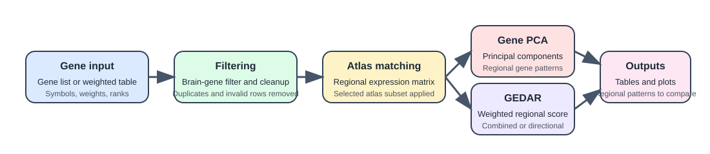

======================
Gene-list PCA workflow
======================

This page is the user guide for ``imt gene-pca`` and ``run_gene_pca()``.

What the workflow does
----------------------

``gene-pca`` is a descriptive workflow. It does not test an imaging map
against gene expression. Instead, it:

1. takes a selected list of genes
2. extracts their atlas expression profiles
3. standardizes each retained gene across regions
4. runs PCA on the resulting ``regions x genes`` matrix

This is useful when you want to turn a curated gene list into one or more
regional expression patterns that can then be compared with imaging maps in a
separate step.

Gene-list input
---------------

The workflow accepts:

- a text file with one gene per line
- a TSV or CSV file that can be tokenized into gene symbols
- a comma-separated list on the CLI
- a Python iterable of symbols in the API

Duplicate genes are removed while preserving their first occurrence.

Filtering before PCA
--------------------

Before PCA is run, the toolbox:

- applies the packaged brain-gene filter
- matches the remaining genes to the selected atlas expression matrix
- reports the outcome in:

  - ``matched_genes.txt``
  - ``brain_filtered_genes.txt``
  - ``missing_genes.txt``

If no genes remain after filtering and matching, the workflow stops with a
clear error.

Standardization and PCA
-----------------------

Let :math:`X` be the selected :math:`\mathrm{regions} \times \mathrm{genes}` expression matrix after
filtering. The workflow standardizes each gene across regions and then runs PCA
on that matrix.

So if :math:`X_j` is one retained gene column:

.. math::

   Z_j = \frac{X_j - \bar{X}_j}{s_j}

where :math:`s_j` is the sample standard deviation across regions. PCA is then run
on the standardized matrix :math:`Z`.

This means the principal components reflect covariance structure across genes
after putting the genes on a comparable scale.

Interpreting the outputs
------------------------

``gene_pca_scores.tsv``
   Regional PCA component scores. These are the regional patterns most users
   compare against imaging maps.

``gene_pca_loadings.tsv``
   Gene loadings for each component. These explain which genes drive each
   regional pattern.

``gene_pca_variance.tsv``
   Explained and cumulative variance for each retained component.

Two interpretation rules matter:

- component signs are arbitrary
- regional scores and gene loadings should be interpreted together

So if a component flips sign, the biology has not changed; only the direction
convention has changed.

CLI examples
------------

File-based gene list:

.. code-block:: bash

   imt gene-pca \
     --genes /absolute/path/to/genes.txt \
     --atlas dk \
     --hemisphere left \
     --ncomp 3 \
     --output /absolute/path/to/out_dir

Comma-separated gene list:

.. code-block:: bash

   imt gene-pca \
     --genes RELN,GAD1,SLC1A2,SV2A \
     --atlas schaefer-100 \
     --hemisphere both \
     --ncomp 3 \
     --output /absolute/path/to/out_dir

Python example
--------------

.. code-block:: python

   import imaging_transcriptomics as imt

   result = imt.run_gene_pca(
       ["RELN", "GAD1", "SLC1A2", "SV2A"],
       atlas="dk",
       hemisphere="left",
       n_components=3,
       output_dir="out_gene_pca",
   )

Reading the plots
-----------------

The workflow writes:

- a variance-explained figure
- one regional score figure per retained component
- one loading figure per retained component
- atlas brain and cortical plots when plotting assets are available

The most useful first combination is usually:

- one component from ``gene_pca_scores.tsv`` or the brain plots
- the matching loadings from ``gene_pca_loadings.tsv``
- the explained variance from ``gene_pca_variance.tsv``

Common pitfalls
---------------

- treating PCA as a significance test rather than as a descriptive reduction
- ignoring the brain-gene filter and then being surprised by genes in
  ``brain_filtered_genes.txt``
- interpreting the sign of a component as fixed rather than arbitrary
