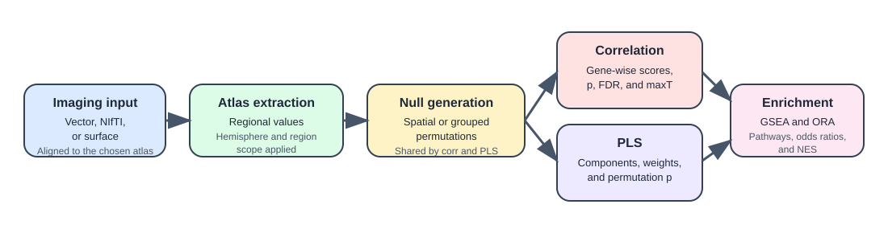

============
PLS workflow
============

This page is the user guide for ``imt pls`` and ``run_pls()``.

What the workflow answers
-------------------------

The PLS workflow asks:

*Which multivariate combinations of genes best explain the regional imaging
map, and which genes load most strongly on those components?*

Use PLS when you expect the imaging signal to be distributed across many genes
rather than concentrated in a small number of strong one-gene associations.

Inputs
------

PLS uses the same imaging inputs and atlas choices as the correlation
workflow:

- regional vectors
- ``MNI152`` NIfTI maps
- supported surface inputs when the ``maps`` extra is installed

You also need either:

- ``n_components`` to keep a fixed number of components
- ``var`` to keep enough components to reach a cumulative explained-variance
  target

Core model
----------

Let :math:`X` be the atlas expression matrix and :math:`y` the imaging vector. The
toolbox uses a local PLS-1 implementation based on SIMPLS.

For each component :math:`k` the model produces:

- a gene weight vector :math:`w_k`
- a regional score vector :math:`t_k = X w_k`
- a per-component explained response variance

The key practical point is that PLS models the imaging vector against the full
gene-expression matrix at once. Gene weights should therefore be interpreted in
the context of the component, not as independent univariate tests.

Choosing the number of components
---------------------------------

``--ncomp`` / ``n_components``
   Keep exactly that many components.

``--var`` / ``var``
   Keep the smallest number of components whose cumulative explained variance
   reaches the requested threshold.

The component p-values are attached to the cumulative model through that
component, so it is often sensible to keep only the first few interpretable
components.

Sign alignment
--------------

PLS component signs are arbitrary. After fitting, the toolbox aligns each
component so that its component scores are positively correlated with the
imaging vector.

This makes downstream interpretation easier:

- positive weights point in the same direction as higher imaging values on the
  aligned component
- negative weights point in the opposite direction

Component-level significance
----------------------------

PLS significance is evaluated by refitting the model on permuted imaging maps.

For each permutation, the workflow recomputes the cumulative explained
variance. The reported component ``p`` in ``pls_summary.tsv`` is:

.. math::

   p_k =
   \frac{1 + \sum_{b=1}^{B} I(R_{k,\mathrm{perm}}^{(b)} \ge R_{k,\mathrm{obs}})}{B + 1}

where :math:`R_k` is the cumulative explained variance through component :math:`k`.

So the p-value for component 2 is really about the first two components taken
together, not only about the incremental variance unique to the second
component.

Gene-level statistics
---------------------

For each retained component, the toolbox also stores the observed gene weights
and the permutation-derived null gene weights.

Before gene-level statistics are computed, permuted weights are:

1. reordered to match the observed gene order
2. sign-aligned to the observed component

The exported columns in ``pls_component_<n>.tsv`` are:

``weight``
   The aligned observed component weight.

``zscore``
   The observed weight divided by the permutation standard deviation.

``p``
   Sign-aware empirical p-value from the permutation weight distribution.

``fdr``
   Benjamini-Hochberg correction across genes within that component.

``maxT``
   Family-wise correction from the largest absolute null weight in each
   permutation.

Two important interpretation points:

- ``zscore`` is descriptive; inference comes from ``p``, ``fdr``, and
  ``maxT``
- ``maxT`` is much stricter than ``fdr`` and will often remain large when
  nominal ``p`` is small

CLI examples
------------

Fixed component count:

.. code-block:: bash

   imt pls \
     --input /abs/path/map.nii.gz \
     --space MNI152 \
     --atlas dk \
     --hemisphere both \
     --regions all \
     --ncomp 2 \
     --permutations 1000 \
     --null-method auto \
     --output /abs/path/out_pls

Variance-targeted component selection:

.. code-block:: bash

   imt pls \
     --input /abs/path/map.nii.gz \
     --space MNI152 \
     --atlas dk \
     --hemisphere both \
     --regions all \
     --var 0.5 \
     --permutations 1000 \
     --null-method auto \
     --output /abs/path/out_pls

Parallel permutation fitting:

.. code-block:: bash

   imt pls \
     --input /abs/path/map.nii.gz \
     --space MNI152 \
     --atlas dk \
     --ncomp 2 \
     --permutations 50000 \
     --jobs 8 \
     --output /abs/path/out_pls

Python example
--------------

.. code-block:: python

   import numpy as np
   import imaging_transcriptomics as imt

   scan = np.linspace(-1.0, 1.0, 83)
   result = imt.run_pls(
       scan,
       atlas="dk",
       hemisphere="both",
       regions="all",
       n_components=2,
       n_permutations=1000,
       output_dir="out_pls",
   )

Interpreting the outputs
------------------------

``pls_summary.tsv``
   Use this first to decide which components are interesting. It tells you how
   much variance each component explains and whether the cumulative model
   remains stronger than the permutation null.

``pls_component_<n>.tsv``
   Use this to inspect the genes driving a component. Positive and negative
   weights describe opposite ends of the aligned component.

``regional_values.tsv``
   This is the regional imaging vector after atlas extraction and should be
   checked whenever the atlas subset or hemisphere handling is in doubt.

Enrichment
----------

PLS supports both GSEA and ORA for each retained component.

- GSEA uses the full ranked component gene table
- ORA thresholds the raw gene ``p`` values within each component and splits the
  genes into ``up`` and ``down``

This makes it possible to interpret a component at three levels:

- explained variance
- individual gene weights
- pathway-level enrichment

Runtime notes
-------------

PLS is usually slower than correlation because it refits a multivariate model
for every permutation.

The main levers are:

- ``--permutations`` for p-value resolution
- ``--jobs`` for parallel permutation fitting
- whether GSEA is enabled

Practical advice:

- use ``--jobs`` on large runs
- use ORA only when you want quick pathway summaries
- expect GSEA on large libraries to add noticeable runtime

Common pitfalls
---------------

- over-interpreting weak later components with large component p-values
- reading component signs as biologically fixed before remembering that the
  signs are aligned for convenience
- assuming the component p-value is about the marginal variance added by that
  one component rather than the cumulative model
